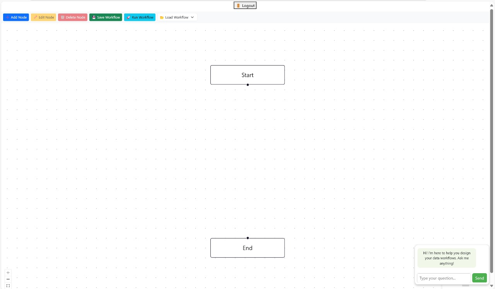

# 🚀 Big Data Workflow Editor

Empowering students to generate **PySpark code** using simple **English text** — a drag-and-drop visual workflow editor built for learning and experimenting with big data processing.

---

## 📸 Screenshots

### 🏠 Home Page
> Welcomes users with a modern landing UI.  
“Try it now” acts as the login button, and new users can sign up easily.


### 🔐 Login Page
> Users enter credentials to access the editor.  
Option to register is also available.


### 🧠 Workflow UI
> Students create step-by-step big data workflows with the help of a chatbot.



---

## 🛠️ Tech Stack

| Layer      | Tech                                 |
|------------|--------------------------------------|
| Frontend   | React.js, HTML, CSS, JavaScript      |
| Backend    | Python, Flask, Flask-CORS, JWT       |
| Database   | MongoDB (via PyMongo)                |
| Others     | Flask-Bcrypt, LLM integration, REST API |

---

## 🚀 Run the Project Locally

Follow these steps to run both **Frontend** and **Backend** on your local machine:

---

### 🔧 1. Clone the Repository

```bash
git clone https://github.com/<your-username>/<your-repo-name>.git
cd <your-repo-name>
```

---

### 🖼 2. Run the Frontend (React)

```bash
cd Frontend
npm install
npm start
```

- This will start the frontend at:  
  👉 http://localhost:3000

---

### 🧠 3. Run the Backend (Flask)

```bash
cd ../Backend
python -m venv venv                    # Create virtual environment
venv\Scripts\activate                  # On Windows
# source venv\Scripts\activate            # On Mac/Linux

pip install -r requirements.txt        # Install dependencies
python app.py                          # Start Flask server
```

- This will start the backend at:  
  👉 http://localhost:5000

---

## 👤 User Roles

- **Students**: Can register, log in, create workflows, and run PySpark code.
- **Instructors**: (Planned) Will review submitted workflows.
- **ChatBot Assistant**: Helps students with code, structure, and debugging.

---

## 📦 Features

- 🔒 User Registration & Login (JWT-based auth)
- 🧩 Drag-and-Drop Workflow Builder
- 💬 LLM ChatBot for help
- 🧪 PySpark Code Generation from Text
- 📄 MongoDB storage for users and workflows


